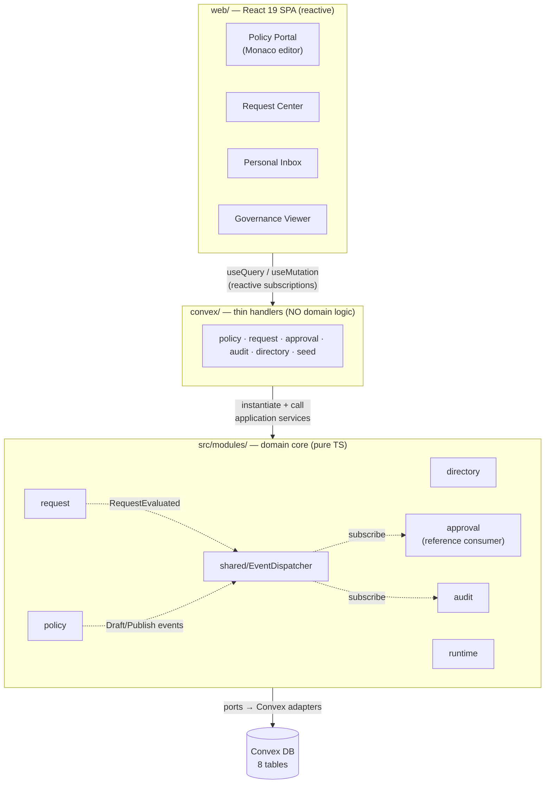
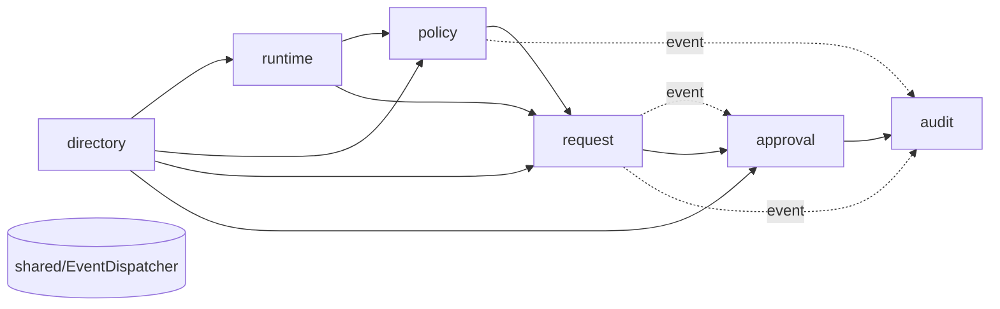
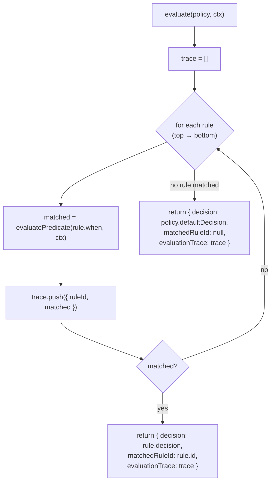
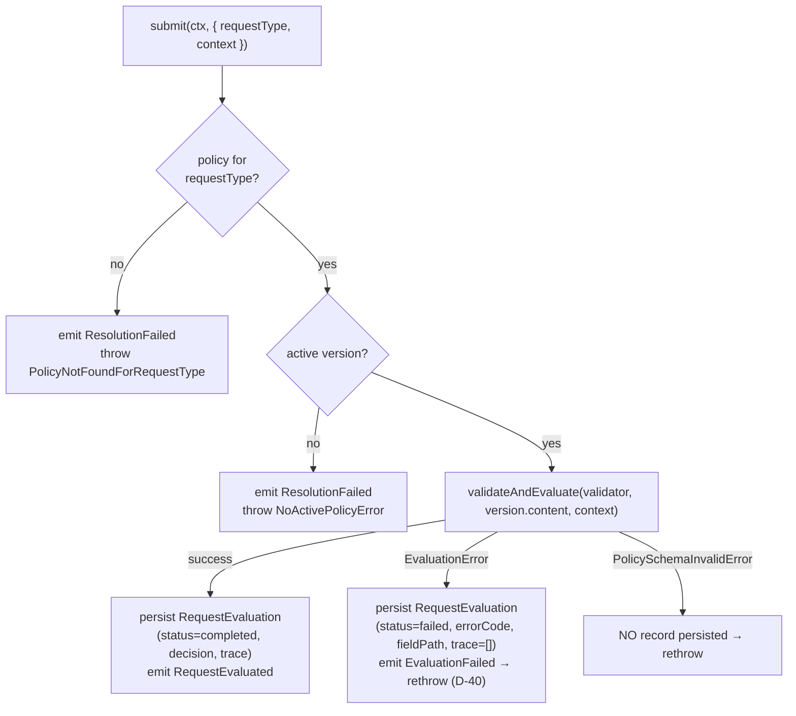
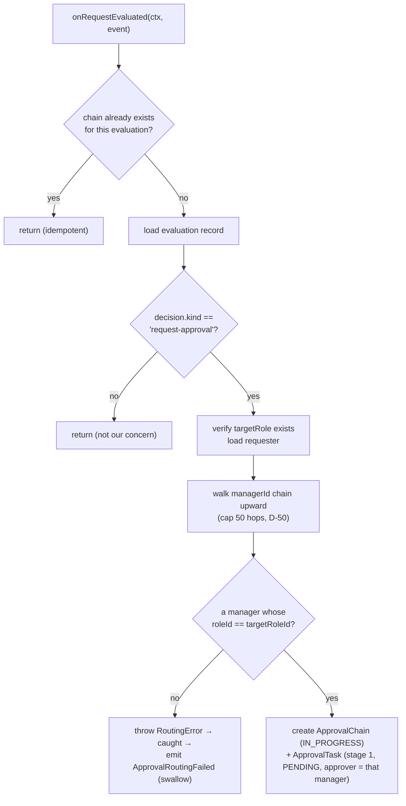
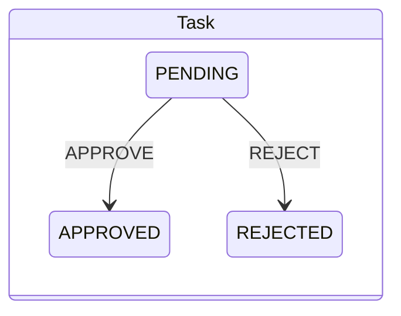
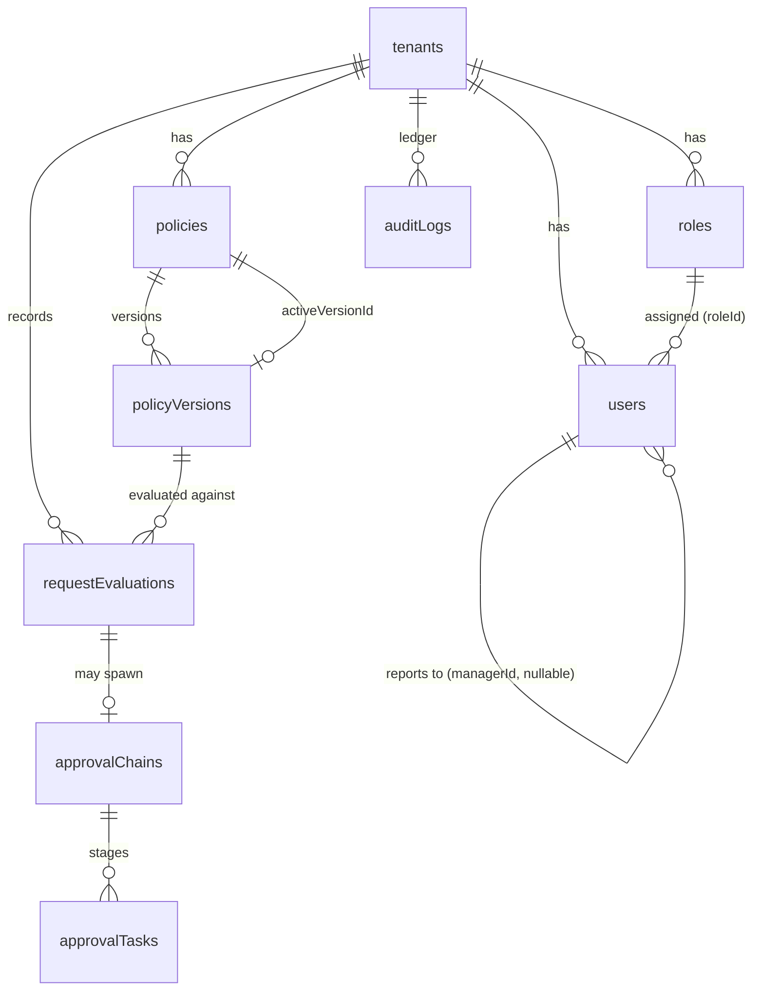

# Mini-stry — Architecture (MVP)

Full technical documentation for the Mini-stry Policy Runtime Platform, v1/MVP (Phases 1–6).
This document is a reference: it explains **what** each part does, **why** it is built that way, and the **trade-offs** accepted. Decision IDs (`D-xx`) reference the project decision log (see [§16](#16-decision-log)) and appear in the source as code comments.

> One-line mental model: **`Policy + EvaluationContext → Decision`** is a pure function. Everything else — persistence, lifecycle, routing, audit, UI — orbits it without leaking into it.

## Table of contents

1. [Purpose & scope](#1-purpose--scope)
2. [Architectural principles](#2-architectural-principles)
3. [System topology](#3-system-topology)
4. [The Hexagonal layer model](#4-the-hexagonal-layer-model)
5. [Module map & dependency rules](#5-module-map--dependency-rules)
6. [The two context envelopes](#6-the-two-context-envelopes)
7. [Branded identifiers](#7-branded-identifiers)
8. [The Policy Runtime](#8-the-policy-runtime)
9. [Policy lifecycle](#9-policy-lifecycle)
10. [Request runtime](#10-request-runtime)
11. [Approval routing (reference Decision Consumer)](#11-approval-routing-reference-decision-consumer)
12. [Events & the governance ledger](#12-events--the-governance-ledger)
13. [Data model](#13-data-model)
14. [The Convex × Ajv trade-off](#14-the-convex--ajv-trade-off)
15. [Frontend architecture](#15-frontend-architecture)
16. [Decision log](#16-decision-log)
17. [Testing strategy](#17-testing-strategy)
18. [Known limitations & non-goals](#18-known-limitations--non-goals)
19. [Glossary](#19-glossary)

---

## 1. Purpose & scope

Mini-stry is a **domain-neutral Policy Runtime Platform**. Its core is a deterministic function that consumes a structured JSON policy and an arbitrary payload (`EvaluationContext`) and produces a `Decision`. The platform wraps that core with:

- a **multi-tenant directory** (tenants, roles, users, reporting lines),
- an **immutable policy lifecycle** (draft → publish → rollback),
- a **request runtime** that runs contexts against active policies and records traces,
- a **reference Decision Consumer** (supervisor approval routing),
- an **immutable audit ledger**, and
- a **reactive admin portal**.

**In scope (MVP):** the above, single-stage manager-walk approval, `compare` predicates, three decision kinds.
**Out of scope (MVP):** custom DSL/compiler, logical operators in rules, multi-stage/parallel approval, real authentication, HR-vertical features. See [§18](#18-known-limitations--non-goals).

---

## 2. Architectural principles

Five constraints govern every change. They are not stylistic — they are the load-bearing invariants.

| # | Principle | Enforced by |
|---|-----------|-------------|
| **P1** | **Domain-neutrality.** No vertical-specific code (HR/finance/role enums) in the domain. `EvaluationContext` is a structurally-typed key/value payload, never a domain record. | Code review; `EvaluationContext` is `Record<string, JsonValue>`. |
| **P2** | **Hexagonal + Modular Monolith.** Domain is pure; all I/O is behind ports with swappable adapters. Modules talk only through public barrels. | ESLint `import/no-restricted-paths`; per-module `index.ts`. |
| **P3** | **Explicit tenant boundary.** `TenantContext` is the first parameter of every application-service method. No ambient resolution (no `AsyncLocalStorage`, no globals). | Method signatures; D-19. |
| **P4** | **No dynamic code execution.** The evaluator uses native TS operators only — never `eval`, never code-gen-from-strings. A policy must pass JSON Schema validation before it is evaluated. | Pure-TS `operators.ts`; `validateAndEvaluate` gate (RUN-03). |
| **P5** | **Consumers depend on the runtime; the runtime depends on no consumer.** Decisions are emitted; acting on them is somebody else's job. | `request` emits events; `approval` subscribes. No reverse import. |

---

## 3. System topology



Three tiers, one direction of dependency (top → bottom):

1. **Presentation** (`web/`) — reactive React views. Subscribes to Convex queries; never reaches into the domain.
2. **Composition / DI** (`convex/`) — *thin* function handlers. They validate input shape, instantiate domain dependencies, call an application service, and map the response. **No business logic** (the "convex/ HARD RULE").
3. **Domain core** (`src/modules/`) — pure-TS modular monolith. Knows nothing about Convex except through adapter implementations of its ports.

---

## 4. The Hexagonal layer model

Every module under `src/modules/<m>/` has the same four-layer shape:

```
src/modules/<module>/
├── domain/         # State + invariants only. No I/O, no framework, no async deps.
│                   #   entities, value objects, branded IDs, events, pure state machines
├── application/    # Orchestration. Services take `ctx: TenantContext` first.
│   ├── *-service.ts
│   └── errors.ts
├── ports/          # Interfaces the application depends on (repository contracts).
├── adapters/
│   ├── convex/     # Implements ports against Convex; maps Convex Id ↔ branded ID.
│   └── memory/     # In-memory fakes — fast, deterministic tests with no DB.
└── index.ts        # Public barrel. The ONLY legal import surface for other modules.
```

| Layer | May import | May NOT do |
|-------|-----------|------------|
| `domain` | Other domain files in the same module | Any I/O, any adapter, any framework, `Date.now()` in pure logic where determinism matters |
| `application` | Own `domain`, own `ports`, other modules' **barrels** | Import a concrete adapter; reach into another module's internals |
| `adapters/convex` | Own `ports`, own `domain`, Convex APIs | Contain business rules (mapping + queries only) |
| `adapters/memory` | Own `ports`, own `domain` | Be used in production wiring |

**Why ports + two adapters?** The in-memory adapter lets the entire domain be tested in-process (227 tests, no DB, sub-second). The Convex adapter is the production binding. Swapping persistence is a matter of writing a third adapter set — the domain does not change.

---

## 5. Module map & dependency rules



| Module | Responsibility | Core entities | Key application service |
|--------|----------------|---------------|--------------------------|
| **directory** | Org chart: tenants, dynamic roles, users, reporting lines. Owns `TenantContext`. | `Tenant`, `Role`, `User` | `RoleService`, `UserService` |
| **runtime** | The pure decision function: schema validation + rule evaluation + Decision factories. Owns the **canonical JSON Schema**. | `PolicyContent`, `Rule`, `Predicate`, `Decision` | `validateAndEvaluate`, `evaluate` (pure functions) |
| **policy** | Policy + version lifecycle: draft, publish, rollback, immutability, active-version pointer. | `Policy`, `PolicyVersion` | `PolicyService` |
| **request** | Resolve a request type → active policy → evaluate → persist record + trace. | `RequestEvaluation` | `PolicyRuntimeService` |
| **approval** | *Reference Decision Consumer.* Turn `request-approval` decisions into approval tasks via manager-walk; run the approve/reject state machine. | `ApprovalChain`, `ApprovalTask` | `ApprovalRoutingService` |
| **audit** | Immutable, by-reference governance ledger over all events. | `AuditLog` | `AuditEventSubscriber`, `RequestAuditSubscriber`, approval audit subscriber |
| **shared** | Typed, synchronous in-process `EventDispatcher`. | — | — |

### The Module Boundary Rule (D-08)

> *"Cross-module imports are ALLOWED through public barrels; cross-module coupling is NOT."*

- ✅ Allowed: `import { PolicyService } from "@/modules/policy"` (the barrel `index.ts`)
- ❌ Forbidden: `import { PolicyService } from "@/modules/policy/application/policy-service.js"` (deep import)

Enforced mechanically by ESLint `import/no-restricted-paths`. The barrel is the contract; internals are free to change behind it. The one asymmetry permitted by **P5**: consumers (`approval`) may import the `runtime`/`request` barrels, but the runtime imports nothing downstream.

---

## 6. The two context envelopes

Mini-stry has two first-class, domain-neutral envelopes that answer two different questions. They are deliberately symmetrical in stature.

| Envelope | Question | Shape | Used by |
|----------|----------|-------|---------|
| **`EvaluationContext`** | *"What data is being evaluated?"* | `Record<string, JsonValue>` (no fixed fields) | The runtime, alongside a policy, to produce a Decision. |
| **`TenantContext`** | *"Who owns this operation?"* | `{ readonly tenantId: TenantId; readonly actorId?: UserId }` | Passed explicitly as the **first parameter** of every application-service method. |

```ts
// src/modules/directory/application/tenant-context.ts
export interface TenantContext {
  readonly tenantId: TenantId;
  readonly actorId?: UserId;   // present when an action is attributed to a user
}
```

**Why explicit, not ambient (D-19, P3)?** Tenant isolation is the platform's hardest security guarantee. Ambient resolution (a global, a request-scoped store) hides the boundary; a missing scope becomes an invisible cross-tenant leak. By making `ctx` the first argument everywhere, every persistence call is visibly tenant-scoped, and a reviewer can spot a leak by reading a single line. The cost — a slightly more verbose signature — is paid once and buys auditability forever.

`actorId` rides in the same envelope so attribution (who created this draft, who approved this task) flows without changing signatures as the platform grows.

---

## 7. Branded identifiers

Domain IDs are **branded strings** (D-14):

```ts
type TenantId = string & { readonly __brand: "TenantId" };
type UserId   = string & { readonly __brand: "UserId" };
// … PolicyId, PolicyVersionId, RoleId, RequestEvaluationId, ApprovalChainId, ApprovalTaskId, AuditLogId
```

- **Zero runtime cost** — brands exist only in the type system; at runtime they are plain strings.
- **Compile-time safety** — you cannot pass a `RoleId` where a `UserId` is expected.
- **Translation at the edge** — Convex adapters convert `Id<"table">` ↔ branded ID in their `mappers.ts`. The domain never sees a raw Convex `Id`; the database never sees a brand. This is also why the UI reads mapped DTO fields (`id`, `payload`, `stageNumber`) rather than raw Convex documents (`_id`) — except where a handler returns a raw document deliberately (e.g. `directory:listTenants`).

---

## 8. The Policy Runtime

The heart of the system: a pure, deterministic, `eval`-free evaluator gated by JSON Schema validation. Lives entirely in `src/modules/runtime/` and has 100% test coverage.

### 8.1 PolicyContent shape (D-24: match-first envelope)

```ts
interface PolicyContent {
  readonly rules: readonly Rule[];          // evaluated top-to-bottom; first match wins
  readonly defaultDecision: Decision;       // emitted if no rule matches
}
interface Rule {
  readonly id: string;
  readonly when: Predicate;                 // v1: a single `compare` predicate
  readonly decision: Decision;
}
type Predicate = { type: "compare"; field: string; op: Operator; value: JsonValue };
```

Example policy content:

```json
{
  "rules": [
    { "id": "manager-approval",
      "when": { "type": "compare", "field": "amount", "op": "gt", "value": 0 },
      "decision": { "kind": "request-approval", "targetRoleId": "<roleId>" } }
  ],
  "defaultDecision": { "kind": "auto-approve" }
}
```

### 8.2 Operators

The evaluator is **type-aware and strict** (`operators.ts`). The operand type drives which operators are legal; a mismatch throws an `EvaluationError("TYPE_MISMATCH")` rather than coercing.

| Operator | Number field | String field | Notes |
|----------|:---:|:---:|-------|
| `eq`, `neq` | ✅ | ✅ | Strict `===`. Value type must match field type. |
| `gt`, `gte`, `lt`, `lte` | ✅ | ❌ | Numeric ordering only. Strings throw. |
| `contains` | ❌ | ✅ | Substring (`String.includes`). Numbers throw. |
| `in` | ✅ (array of numbers) | ✅ (array of strings) | Membership; array element type must match field type. |

A field absent from the `EvaluationContext` throws `EvaluationError("MISSING_FIELD")` — there is no silent `undefined`.

### 8.3 Evaluation algorithm (`evaluate`)



The **`evaluationTrace`** is first-class output: a `{ ruleId, matched }` entry for every rule considered, in order. It is what the Request Center renders and what the governance ledger can reconstruct.

### 8.4 Decision (D-29: open discriminated union)

```ts
type Decision =
  | { readonly kind: "auto-approve" }
  | { readonly kind: "auto-reject" }
  | { readonly kind: "request-approval"; readonly targetRoleId: RoleId };
```

The union is discriminated by `kind` and **open by design**: future outcomes (escalate, request-info) add a member without changing the evaluator's contract. Factory functions (`autoApprove()`, `autoReject()`, `requestApproval(roleId)`) are the construction surface.

### 8.5 The validation gate (RUN-03)

The evaluator must **never** run on an unvalidated policy. That invariant is enforced in one place:

```ts
// src/modules/runtime/application/policy-runtime.ts
export function validateAndEvaluate(validator, content: unknown, ctx): EvaluationResult {
  const result = validator.validate(content);
  if (!result.ok) throw new PolicySchemaInvalidError(result.errors);
  return evaluate(result.value, ctx);   // result.value is narrowed to PolicyContent
}
```

`SchemaValidatorPort.validate` returns a **discriminated `ValidationResult`** (`{ ok: true, value: PolicyContent }` | `{ ok: false, errors }`). On success it narrows `content: unknown` to `PolicyContent`, so there is no cast at the call site — the single runtime-to-type cast lives inside the Ajv adapter. The canonical schema (`policy-content.schema.json`, D-23) is the **one source of truth** reused by the runtime, the lifecycle (`PolicyService`), and the Monaco editor in the UI.

### 8.6 Error taxonomy

| Error | Raised when | Carries |
|-------|-------------|---------|
| `PolicySchemaInvalidError` | Content fails JSON Schema validation | structured `{ code, path, message }[]` |
| `EvaluationError` | A predicate hits a runtime problem | `code` (`MISSING_FIELD` \| `TYPE_MISMATCH` \| `UNSUPPORTED_OPERATOR`), `field` |

These two classes draw the line between "the policy is malformed" and "the policy is well-formed but this context can't be evaluated against it."

---

## 9. Policy lifecycle

`PolicyService` (in `policy/`) owns the draft → publish → rollback lifecycle with immutability and optimistic concurrency.

### 9.1 Version state machine

```mermaid
stateDiagram-v2
    [*] --> draft: createDraft (one per policy, D-32)
    draft --> draft: saveDraft (revision++, D-36; re-validates, D-34)
    draft --> published: publishDraft (requires validationStatus=valid)
    published --> [*]: immutable (POL-03)
    published --> draft: rollback → forward clone (new draft, D-33)
```

### 9.2 Rules and their rationale

| Rule | Behaviour | Why |
|------|-----------|-----|
| **One draft per policy** (D-32) | `createDraft`/`rollback` reject if an open draft exists. | A single editable head avoids ambiguous "which draft is current?" |
| **Validate on every save, gate only on publish** (D-34) | `saveDraft` re-validates and stores `validationStatus` + `validationErrors`, but **always persists** — even invalid content. `publishDraft` refuses unless `validationStatus === "valid"`. | Authors can save work-in-progress; only published versions are guaranteed valid. Mirrors the UI: "Save draft" is always allowed; "Publish" is server-authoritative (D-58). |
| **Immutability** (POL-03) | `saveDraft`/`publishDraft` throw `ImmutableVersionError` on a published version. | Published versions are an audit anchor; they never change. |
| **Optimistic concurrency** (D-36) | `saveDraft` requires `expectedRevision`; a mismatch throws `ConflictError`. | Lost-update protection without locks. |
| **Rollback = forward clone** (D-33) | `rollback(target)` creates a **new draft** cloning the target's content + validation status; it sets `rollbackFromVersionId` and emits `DraftCreated` (no separate `PolicyRolledBack` event). History is never mutated. | Rollback is "author a new version that happens to match an old one," preserving the immutable timeline. Target content is **not** re-validated — historical published versions are already valid, and this decouples rollback from future validator changes. |
| **Active pointer** (POL-04) | `publishDraft` calls `policyRepo.updateActiveVersion`. | One active version per policy drives request evaluation. |

---

## 10. Request runtime

`PolicyRuntimeService.submit` (in `request/`) is the entry point that turns a submitted context into a persisted, traced decision.



Three deliberately distinct outcomes:

1. **Success** → a `completed` record with the `decision` and the full `evaluationTrace`; emits `RequestEvaluated` (the event the approval consumer and audit subscribe to).
2. **`EvaluationError`** (well-formed policy, bad context) → a `failed` record capturing `errorCode` + `fieldPath` with an empty trace (D-42), then **rethrows** (D-40) so the caller sees the failure. The failure is recorded because it is operationally meaningful.
3. **`PolicySchemaInvalidError`** (the active policy itself is malformed) → **no** record is persisted, just a rethrow. A published policy should never be invalid; this path is defense-in-depth, not a routine outcome, so it is not logged as a request failure.

`validateAndEvaluate` is called here even though the version was validated at publish time — **defense in depth**: the runtime never trusts that stored content is valid.

---

## 11. Approval routing (reference Decision Consumer)

`ApprovalRoutingService` (in `approval/`) is the canonical example of a **Decision Consumer**: it subscribes to `RequestEvaluated`, reads the decision, and acts. The runtime has **no** compile-time knowledge of it (P5, D-03). Any number of consumers could subscribe the same way.

### 11.1 Materialization — `onRequestEvaluated`



Key properties:

- **Idempotent** — re-delivery of `RequestEvaluated` (Convex can retry) finds the existing chain and returns. Safe to fire twice.
- **Selective** — only `request-approval` decisions route; `auto-approve`/`auto-reject` are ignored.
- **Manager-walk** — starting from the requester's `managerId`, it climbs the reporting line until it finds a manager holding the `targetRoleId`. The walk is capped at `MAX_HIERARCHY_DEPTH = 50` (D-50) as a *defensive* guard against corrupted hierarchies; the *primary* cycle protection is write-time (`UserService.setManager`, D-11).
- **Failure-swallow** — routing problems (`RoutingError`, `RoleNotFoundError`, `HierarchyTraversalError`) are caught, emitted as `ApprovalRoutingFailed`, and **do not throw**. A consumer must never break the producer: a failed routing must not roll back a successful evaluation. Unexpected errors still propagate.

### 11.2 Acting — `act` and the state machines



`act(ctx, taskId, "APPROVE" | "REJECT")`:

1. Loads the task; throws `TaskAlreadyResolvedError` if missing or not `PENDING`.
2. **Authorization** — `ctx.actorId` must equal `task.approverId`, else `UnauthorizedApproverError`. (This is the MVP's stand-in for real authz.)
3. Transitions via the pure `transitionTask` (only `PENDING` is a legal source state).
4. Recomputes the chain status via `deriveChainStatus`: any `REJECTED` task ⇒ chain `REJECTED`; all `APPROVED` ⇒ chain `APPROVED`; otherwise `IN_PROGRESS`.
5. Emits `ApprovalTaskApproved` / `ApprovalTaskRejected` (which the audit ledger records).

Both `transitionTask` and `deriveChainStatus` are **pure domain functions** in `state-machine.ts` — fully unit-tested without any I/O. In the MVP a chain has a single stage; the `deriveChainStatus` design already generalizes to multi-stage chains (a v2 concern).

---

## 12. Events & the governance ledger

### 12.1 EventDispatcher (D-35)

`src/shared/event-dispatcher.ts` is a generic, typed, **synchronous in-process** event bus:

```ts
class EventDispatcher<EventMap extends Record<string, unknown>> {
  on<K>(type: K, handler): void;
  async emit<K>(type: K, event): Promise<void>;   // handlers awaited sequentially
  onError?: (type, error) => void;                // per-handler isolation (D-54)
}
```

Semantics that matter:

- **Sequential & awaited** — handlers run in registration order, each awaited before the next. Deterministic for tests.
- **Per-handler error isolation** (D-54) — if one subscriber throws, `onError` is notified and the **remaining subscribers still run**. The error hook itself is guarded so it can't break the chain. This is what makes "audit + routing both subscribe to one event" safe: a routing failure can't suppress the audit write.
- **In-process, not durable** — there is no queue. Events live for the duration of the Convex function call. Adequate for the MVP; a durable broker is a v2 scaling concern.

### 12.2 Event catalog

| Emitter | Event | Consumed by |
|---------|-------|-------------|
| `PolicyService` | `DraftCreated` (also = rollback, `rollbackFromVersionId != null`), `DraftUpdated`, `PolicyPublished` | audit |
| `PolicyRuntimeService` | `RequestEvaluated`, `EvaluationFailed`, `ResolutionFailed` | approval, audit |
| `ApprovalRoutingService` | `ApprovalTaskApproved`, `ApprovalTaskRejected`, `ApprovalRoutingFailed` | audit |

### 12.3 By-reference audit (D-37)

`AuditEventSubscriber`, `RequestAuditSubscriber`, and the approval audit subscriber translate domain events into `auditLogs` rows. The ledger is:

- **Append-only / immutable** — entries are created, never updated or deleted.
- **By-reference** — payloads store **IDs and metadata**, never policy content or full snapshots. An audit row says *"version 3 of policy X was published by user Y,"* not the rules themselves. This keeps the ledger compact and avoids duplicating mutable-looking data.
- **Open `eventType`** (D-16) — `eventType` is a free string (`policy.published`, `approval.task_approved`, …), so new event kinds need no schema migration.

The portal's **Governance Viewer** renders this ledger directly (`eventType`, timestamp, JSON payload).

---

## 13. Data model

Convex schema (`convex/schema.ts`) — eight tables. Every tenant-owned table prefixes its indexes with `tenantId` (**D-09**), which is the physical expression of P3: tenant scoping is baked into every access path.



| Table | Purpose | Notable fields / indexes |
|-------|---------|--------------------------|
| `tenants` | Isolation root | `name`, `createdAt` |
| `users` | Directory members | `roleId`, `managerId` = `v.union(id, null)` self-ref (D-11); reserves Convex Auth fields (`email`, `emailVerificationTime`, `isAnonymous`, …); indexes `by_tenant_email`, `by_tenant_role`, `by_tenant_manager`, `by_email` |
| `roles` | Dynamic per-tenant roles | uniqueness `[tenantId, name]` enforced in the **application** layer (D-10), not the index |
| `policies` | Policy header | `requestType`, `activeVersionId` (nullable); `by_tenant_request_type` |
| `policyVersions` | Immutable-once-published versions | `content: v.any()` (shape owned by runtime, D-12), `status`, `validationStatus`, `validationErrors[]`, `revision` (D-36), `rollbackFromVersionId` (D-33), `createdBy`, `publishedAt` |
| `requestEvaluations` | Evaluation records | `requestInput`, `decision`, `trace[{ruleId,matched}]`, `status` (`completed`\|`failed`), `errorCode`, `fieldPath`, `requesterId` |
| `approvalChains` | One chain per routed evaluation | `requestEvaluationId`, `status`; `by_tenant_request_evaluation` (idempotency lookup) |
| `approvalTasks` | Approval stages | `chainId`, `stageNumber`, `approverId`, `approverRoleId`, `state`; `by_tenant_approver` (inbox lookup) |
| `auditLogs` | Governance ledger | `eventType` (open, D-16), `payload: v.any()`; `by_tenant_created` |

**Indexing strategy.** Indexes are designed around the actual access paths: `by_tenant_approver` powers the Personal Inbox, `by_tenant_request_evaluation` makes routing idempotency a point lookup, `by_tenant_created` orders the governance timeline. Convex indexes do not enforce uniqueness, so business uniqueness (`roles[tenantId,name]`, `policies[tenantId,requestType]`) is enforced in services before insert.

---

## 14. The Convex × Ajv trade-off

**Problem.** Ajv compiles JSON Schemas into validator *functions at runtime* using `new Function(...)`. The Convex V8 isolate forbids code-generation-from-strings (`EvalError: Code generation from strings disallowed`). So Ajv's normal path cannot run inside a Convex function — and the schema validator is required *inside* Convex (the policy lifecycle validates on save/publish).

**Solution.** Precompile the schema **ahead of time** into a standalone ES module and ship that instead of compiling at runtime:

```js
// compile-schema.js  (run when the schema changes)
const ajv = new Ajv({ allErrors: true, strict: true, allowUnionTypes: true,
                      code: { source: true, esm: true } });
const validate = ajv.compile(schema);
fs.writeFileSync("src/modules/runtime/adapters/ajv/compiled-schema.js",
                 standaloneCode(ajv, validate));
```

`AjvSchemaValidator` imports the precompiled `compiled-schema.js` (a pure function, no `eval`) and adapts it to `SchemaValidatorPort`. The platform gets strict, standards-compliant JSON Schema validation natively inside Convex.

**Trade-off accepted.** The validator is a **generated artifact**: editing `policy-content.schema.json` requires re-running `node compile-schema.js` (and `scripts/compile-schema.js` for the Convex build). The schema remains the single source of truth (D-23); the compiled file is a derived build output.

---

## 15. Frontend architecture

`web/` is a React 19 SPA whose entire purpose is to be a thin, reactive window onto the Convex backend.

### 15.1 Stack & structure

- **React 19 + Vite + `react-router-dom`**, **Convex React client** for reactive queries/mutations.
- **shadcn/ui** (Radix primitives), **dark-mode only**, HSL design tokens (Linear/Vercel aesthetic). Single restrained accent; destructive red reserved for reject/auto-reject.
- **`@monaco-editor/react`** fed the **canonical** `policy-content.schema.json` (schema parity, D-59) for live advisory validation + autocomplete.

```
web/src/
├── app/context/DemoContext.tsx   # { tenantId, actorId } — no auth (MVP)
├── components/AppShell.tsx        # nav rail + DemoContextSelector
├── components/ui/                 # shadcn primitives
├── features/<area>/
│   ├── *-hooks.ts                 # useQuery/useMutation wrappers that inject ctx
│   └── *.tsx                      # presentational components
└── routes/                        # PolicyPortal · RequestCenter · Inbox · Governance
```

### 15.2 The DemoContext pattern (D-55/56/57)

There is no authentication in the MVP. A `DemoContext` holds `{ tenantId, actorId }` selected from a top-of-rail dropdown. Every feature hook injects this context into its Convex call:

```ts
export function usePolicies() {
  const { tenantId } = useDemoContext();
  return useQuery(api.policy.listPolicies, tenantId ? { tenantId } : "skip");
}
```

Switching the tenant re-scopes every view (D-56); switching the user re-scopes the inbox. All four modules are always visible (no role-gating in the demo, D-57). The Convex Auth fields reserved in the `users` table are the seam where real auth slots in later.

### 15.3 Reactivity (D-63)

All four operational views use Convex **reactive queries** — no manual refresh. The platform's signature demo is the **cross-user reactive flow**: a requester submits in the Request Center → the assigned approver's Inbox updates live → the approver acts → the requester's log and the Governance timeline update live. Because correctness lives in the query results (not the socket), a dropped subscription never affects correctness — it simply reconnects.

### 15.4 The four views

| View | Requirement | What it does |
|------|-------------|--------------|
| **Policy Portal** | UI-01 | 65/35 split: Monaco editor (left) + Lifecycle & Versions panel (right). Save draft (always allowed) / Publish (server-authoritative) / Rollback. Active version accent-highlighted. |
| **Request Center** | UI-02 | JSON `EvaluationContext` intake + live execution log with decision state and step-by-step trace. |
| **Personal Inbox** | UI-03 | Tasks assigned to the active user; inline Approve/Reject, state-driven. |
| **Governance Viewer** | UI-04 | Audit timeline (chronological) + policy-version comparison. |

---

## 16. Decision log

Curated index of the load-bearing decisions. IDs appear as `D-xx` comments in the source. Full narrative rationale is in `.planning/PROJECT.md` and the per-phase plans.

| ID | Decision | Rationale (short) |
|----|----------|-------------------|
| **D-08** | Module Boundary Rule — barrels only, no deep imports | Maintainability; internals stay swappable. Enforced by ESLint. |
| **D-09** | Every tenant-owned index is `tenantId`-prefixed | Tenant scoping baked into every access path. |
| **D-10** | Role `[tenantId,name]` uniqueness in application layer | Convex indexes don't enforce uniqueness. |
| **D-11** | `managerId` = nullable self-reference; cycle prevention at write time | Reporting lines; primary cycle guard. |
| **D-12** | `policyVersions.content` is `v.any()` | The runtime (Phase 2), not the schema, owns rule shape. |
| **D-14** | Branded string IDs + edge mappers | Type safety, zero runtime cost. |
| **D-16** | `auditLogs.eventType` is an open string | New events need no migration. |
| **D-19** | `TenantContext` is the explicit first parameter everywhere | Tenant boundary visible at every call site. |
| **D-23** | One canonical `policy-content.schema.json` | Single source of truth: runtime + lifecycle + Monaco. |
| **D-24** | Match-first policy envelope (`rules` + `defaultDecision`) | First matching rule wins; deterministic. |
| **D-29** | `Decision` is an open discriminated union by `kind` | New outcomes plug in without runtime changes. |
| **D-32** | One draft per policy; `status` = draft\|published | Single editable head. |
| **D-33** | Rollback = forward clone (new draft), no separate event | Immutable timeline preserved. |
| **D-34** | Validate on every save; gate only at publish | WIP saves allowed; published is always valid. |
| **D-35** | Synchronous typed in-process `EventDispatcher` | Decoupling without a broker. |
| **D-36** | Optimistic concurrency via `revision` | Lost-update protection without locks. |
| **D-37** | By-reference audit payloads (IDs, never content) | Compact, non-duplicative ledger. |
| **D-40/42** | Failed evaluation: record + rethrow; empty trace | Operationally meaningful failures are visible. |
| **D-50** | Manager-walk depth cap = 50 (defensive) | Guard against corrupted hierarchies / DOS. |
| **D-54** | EventDispatcher per-handler error isolation | One subscriber can't break siblings. |
| **D-55/56/57** | Demo context; tenant switch re-scopes; no role-gating | MVP without real auth. |
| **D-58/59/60** | Server-authoritative publish; Monaco schema parity; version panel | UI honors the runtime contract. |
| **D-63** | Convex reactive queries; dropped subscription ≠ incorrectness | Live cross-user flow. |
| **convex/ HARD RULE** | Handlers are thin DI only | No domain logic outside the core. |

---

## 17. Testing strategy

- **227 tests across 34 files** (Vitest), **100% coverage on the runtime** (`src/modules/runtime/**`), 90%+ on critical business logic.
- **In-memory adapters** mirror every Convex repository, so the entire domain — lifecycle, evaluation, routing, audit — is tested in-process with no database. Tests are deterministic and sub-second.
- **Pure domain functions** (`evaluate`, `transitionTask`, `deriveChainStatus`, operators) are unit-tested exhaustively, including the type-mismatch and missing-field error paths.
- **Tenant-isolation tests** assert that `listByTenant` / `findByApprover` / `findByTenant` never cross tenants.
- **Frontend** has a vitest + Testing Library setup covering the DemoContext guard and the policy hooks' context-injection guard. UI correctness is additionally verified end-to-end against live seeded data (the cross-user reactive flow).

Run: `npm test` (backend) · `cd web && npm test` (frontend).

---

## 18. Known limitations & non-goals

| Area | MVP state | v2 direction |
|------|-----------|--------------|
| **Auth** | Demo context (`{tenantId, actorId}`), no real authn/authz. Convex Auth fields reserved in schema. | Convex Auth; role-gated UI. |
| **Rule expressiveness** | Single `compare` predicate per rule; no `AND`/`OR`/`NOT`. | RUN-04 logical operators (the `Predicate` union and evaluator switch already anticipate this). |
| **Approval topology** | Single-stage manager-walk; one task per chain. | DEC-04 parallel / N-of-M groups; multi-stage chains (`deriveChainStatus` already generalizes). |
| **Version numbering** | `getNextVersionNumber` = query-max + 1 (not atomic). | Atomic allocation within a transaction. |
| **Eventing** | Synchronous, in-process, non-durable. | Durable broker for async fan-out; DEC-05 SLA/escalation; DEC-06 more consumers. |
| **Schema validator** | Precompiled artifact; needs regeneration on schema change. | Build-step automation in CI. |
| **Frontend bundle** | Monaco ≈ 500 KB single chunk. | Code-splitting / lazy Monaco. |
| **Integrations** | None. | INT-01 Slack/Teams, INT-02 Calendar. |

**Explicit non-goals (MVP):** custom DSL/lexer/parser/AST compiler; HR-vertical features (payroll, attendance, reviews); a visual workflow builder. Policies are authored as JSON in Monaco.

---

## 19. Glossary

| Term | Meaning |
|------|---------|
| **Policy / Policy Version** | A named rule set / an immutable-once-published snapshot of its content. |
| **EvaluationContext** | Domain-neutral key/value payload evaluated against a policy. |
| **TenantContext** | `{ tenantId, actorId? }` operational envelope; first arg of every service method. |
| **Decision** | Runtime output: `auto-approve` \| `auto-reject` \| `request-approval{targetRoleId}`. |
| **Evaluation trace** | Ordered `{ ruleId, matched }` list produced by the evaluator. |
| **Decision Consumer** | An external service that acts on Decisions (e.g. approval routing). The runtime never imports one. |
| **Approval Chain / Task** | A materialized routing instance / a single approver stage within it. |
| **Port / Adapter** | A repository interface (port) and its Convex / in-memory implementations (adapters). |
| **Barrel** | A module's public `index.ts` — the only legal cross-module import surface. |
| **By-reference audit** | Ledger entries that store IDs/metadata, never content snapshots. |

---

*This document describes the MVP (Phases 1–6). Update it at phase/milestone transitions when an architectural invariant, module contract, or load-bearing decision changes.*
